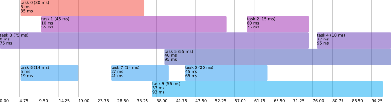

# Thread Time Line



Generate svg timeline from json.

## Example

```
python3 app/run.py example/in.json --out res/out.svg --config example/config.json
```

## Install

```
pip3 install -r requirements.txt
```

see [svgwrite (github)](https://github.com/mozman/svgwrite)

## Config

see `example/config.json`

color palette taken from: <https://www.materialui.co/colors>
